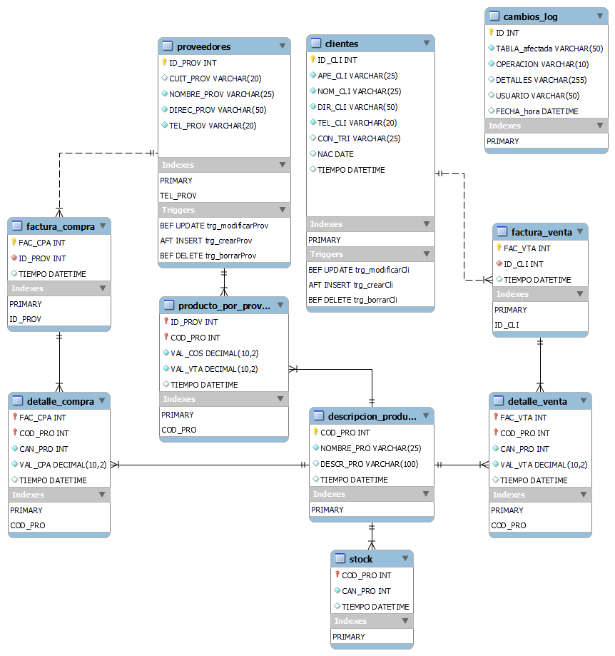
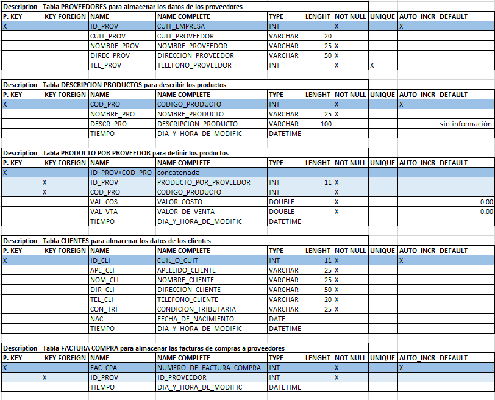
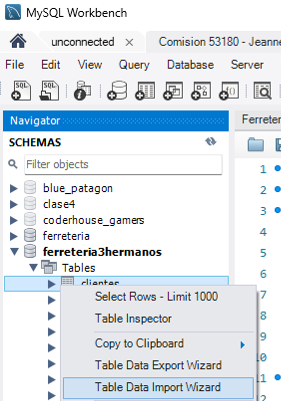
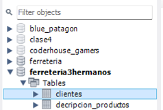
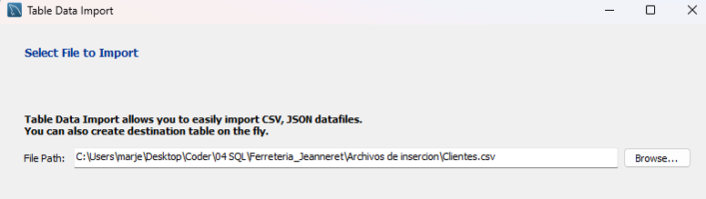
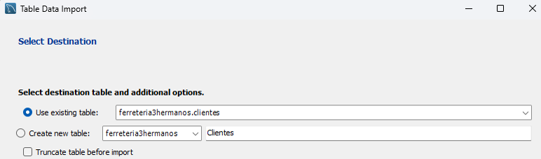
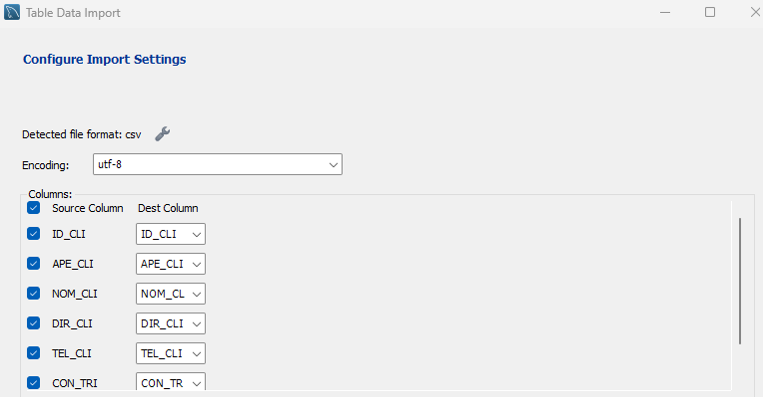
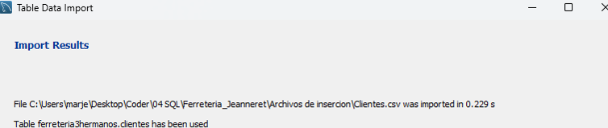

# 
Entrega de proyecto final

* Alumno: Jeanneret Mariano Martin

* Comision; 53180

* Tutor: Santiago Angel Gonzalez Martin

* Docente: Anderson Michel TORRES

Inserción de datos
Se calculan los datos y se cargan en el archivo excel "SQL tablas.xlsx" a continuación de cada tabla cuidando de cargar cada registro separando los datos con coma a fin de luego pegar en un excel nuevo los registros para cada tabla y guardarlos como .csv 

## Tematica del proyecto

Contactados por el comercio “Los tres hermanos” dedicado al rubro ferretero se pactan y realizan 2 entrevistas iniciales con el analista funcional luego de una primer entrevista con el sector de ventas.

## Modelo de negocio

El modelo de negocios es el de una ferreteria de barrio que estando en expansión quiere generar una base de datos sobre el stock para manejar las existencias a partir de las compras y las ventas al tiempo que busca registrar las facturas de ambas operaciones. En un futuro estaría vinculando la base a una plataforma de ventas online al tiempo que piensa abrir mas sucursales de seguir creciendo en ventas.

## Diagrama entidad relacion (DER)

## Listado de tablas y descripcion

Las tablas generadas fueron 10 de las cuales 9 fueron creadas e ingestadas mediante la utilización de tablas CSV y una décima tábla fue generada a fin de servir de LOG y ser posteriormente ingestada mediante triggers a medida que se produjeran cambiós en las táblas clientes o proveedores

A continuación se adjunta el detalle de las tablas involucradas

## Estructura e ingesta de datos

Se calculan los datos y se cargan en el archivo excel "SQL tablas.xlsx" a continuación de cada tabla cuidando de cargar cada registro separando los datos con coma a fin de luego pegar en un excel nuevo los registros para cada tabla y guardarlos como .csv 

ingestaremos los registros de la tabla "clientes"

Se importa el archivo clientes

Se usa la tabla existente y no se trunca porque la tabla ya estaba vacia

Se verifica la codificación (aunque viene por defecto) y se controla la coincidencias entre columnas

y tabla completa…

A continuación se carga la siguiente tabla hasta completar las 9 (solo no se carga la de log ya que se cargará a medida que se realicen las inserciones, modificaciones o eliminaciones de registros)

## Objetos de la base de datos
### Vistas
> - 1.- Creamos una vista que nos devuelva los 3 clientes que mas dinero gastaron ordenando los mismos del que mas al que menos gastó
> - 2.- Creamos una vista que nos diga cuales fueron los 2 proveedores a los que mas le compramos.
> - 3.- Creamos una vista que nos muestre a los proveedores que están radicados en CABA
> - 4.- Creamos una vista que nos muestre a los proveedores que se encuentran en el interior 
> - 5.- Creamos una vista que nos muestre Apellido y Nombre de cada cliente y que luego los concatene

### Funciones
> - 1.- Creamos una función que nos retorna la descripción de un producto cuando ingresamos el nombre del mismo
> - 2.- Creamos una función que ante el apellido de un cliente nos retorna su número de teléfono

### Store Procedures
> - 1.- Creamos un procedimiento que nos devuelva quienes fueron los 3 clientes que mas veces compraron un producto considerando todas las facturas si un cliente compró mas de una vez. Buscamos por código de producto
> - 2.- Creamos un procedimiento que nos devuelva cual fue el producto mas comprado por un cliente considerando todas las facturas si este compró mas de una vez.Buscamos por apellido

### Triggers

> - 1.- Creamos un trigger que cargue un registro identificando al usuario que haya insertado un registro en la tabla de proveedores
> - 2.- Creamos un trigger que cargue un registro identificando al usuario que haya modificado un registro en la tabla de proveedores
> - 3.- Creamos un trigger que cargue un registro identificando al usuario que haya eliminado un registro en la tabla de proveedores
> - 4.- Creamos un trigger que cargue un registro identificando al usuario que haya insertado un registro en la tabla de clientes
> - 5.- Creamos un trigger que cargue un registro identificando al usuario que haya modificado un registro en la tabla de clientes
> - 6.- Creamos un trigger que cargue un registro identificando al usuario que haya eliminado un registro en la tabla de clientes.

## Roles y permisos

## Back up de la base de datos

## Herramientas y tecnologias usadas
Las tecnologias usadas fueron el lenguaje SQL y sus sublenguajes 
 - DDL (Data Definition Language): Se utiliza para definir y modificar la estructura de las bases de datos y sus objetos, como tablas, índices, vistas, y restricciones. Algunos ejemplos de comandos DDL son CREATE, ALTER y DROP.

 - DML (Data Manipulation Language): Se utiliza para manipular los datos en la base de datos, como insertar, actualizar, eliminar y seleccionar registros en las tablas. Los comandos DML más comunes son INSERT, UPDATE, DELETE y SELECT.

 - DCL (Data Control Language): Se utiliza para gestionar los permisos de acceso a los datos y otros objetos de la base de datos. Los comandos DCL incluyen GRANT (conceder permisos) y REVOKE (revocar permisos).

 Las herramientas fueron Workbench a fin de correr el motor MySQL

 También se utilizó DrawIo a fin de la planificación inicial de la base de datos y finalmente GitHub así como Git a fin de poder subir el proyecto y sus avances a la nube

## Como levantar el proyecto en CodeSpaces GitHub
* env: Archivo con contraseñas y data secretas
* Makefile: Abstracción de creacción del proyecto
* docker-compose.yml: Permite generar las bases de datos en forma de contenedores

#### Pasos para arrancar el proyecto en terminal (Linux)
* `make` si da un error de no conexión al socket volver a ejecutar
* `make clean-db` para limpiar la base de datos
* `make test-db` inspecciona los datos en tablas
* `make backup-db` realiza el backup de la base
* `make acces-db` da acceso a la base de datos
